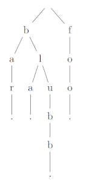

# Musterlösung für die Rechercheaufgabe "Präfixpappeln"

[//]: # (20:57 - 21:13 + knuth 21:29 => ca 30 min => 2h für Studis)

Ein Trie ist ein Suchbaum.
Anders als bei einem Binärer Suchbaum kann ein Knoten in einem Trie jedoch mehr als zwei Kinder haben und repräsentiert nicht den Wert selbst, sondern nur ein Präfix des Wertes.

Ein unkomprimierter Trie aus den Worten "bla", "bar", "blubb" und "foo" würde wie folgt aussehen:

Um nach dem Wort "bla" zu suchen, beginnt man bei der Wurzel und wählt den Knoten, der dem ersten Buchstaben des Wortes (b) entspricht.
Von diesem Knoten aus, wählt man den Knoten, der dem zweiten Buchstaben des Wortes (l) entspricht.
Zum Schluss findet man einen Knoten, der das Blatt (.) enthält und weiß daher, dass der String in dem Trie enthalten ist.

Bei der Suche nach dem Wort "ba" folgt man dem gleichen Schema. Der Knoten (b -> a) an dem man angelangt, hat aber kein zugeordnetes Blatt.
Daher ist klar, dass das Wort "ba" nicht im Trie enthalten ist.

Auf jeder Ebene i eines Tries muss man nur den Knoten finden, der dem Buchstaben an der Position i im gesuchten String entspricht. Das kann z.B. mit einer einfachen Tabelle in O(1) geschehen.
Für jeden Buchstaben im gesuchten String muss man (im worst case) eine Ebene des Trie durchlaufen.
Man erhält also eine Laufzeit von O(1 * m) = O(m).

Wenn man ein Trie betrachtet, das alle Strings (mit den Buchstaben a bis z) der Länge m speichert, ist n = 26m.
Wenn man den Logarithmus zur Basis 26 auf beiden Seiten nimmt, bekommt man die Gleichung m = log26 n .
In diesem Fall ist die Laufzeit der Suche also in O(log n).
Die Suche in einem Trie ist also nicht automatisch schneller als die Suche in einem binären Suchbaum.

Quellen:

* https://de.wikipedia.org/wiki/Trie (hier ist interessanterweise die deutsche Wikipedia besser)
* Donald Knuth: 6.3: Digital Searching. In: The Art of Computer Programming Volume 3: Sorting and Searching, 2nd. Auflage, Addison-Wesley, 1997, ISBN 0-201-89685-0, S. 492.